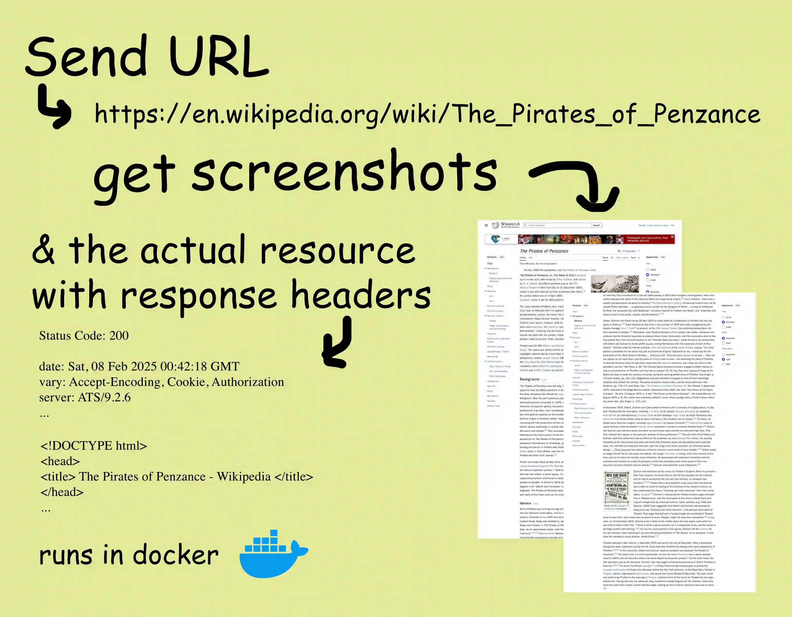

# ScrapeServ: Simple URL to screenshots server

You run the API as a web server on your machine, you send it a URL, and you get back the website data as a file plus screenshots of the site. Simple as.

<br/>
<div align="center" style="display:flex;justify-content:center;margin: 2rem 0px;">

</div>
<br/>

> **Note:** This is a fork of the original [ScrapeServ](https://github.com/US-Artificial-Intelligence/scraper) project. See [Changes in This Fork](#changes-in-this-fork) for modifications made on top of the original.

This project was made to support [Abbey](https://github.com/goodreasonai/abbey), an AI platform. Its author is [Gordon Kamer](https://x.com/gkamer8). Please leave a star if you like the project!

Some highlights:
- Scrolls through the page and takes screenshots of different sections
- Runs in a docker container
- Browser-based (will run websites' Javascript)
- Gives you the HTTP status code and headers from the first request
- Automatically handles redirects
- Handles download links properly
- Tasks are processed in a queue with configurable memory allocation
- Blocking API
- Zero state or other complexity

This web scraper is resource intensive but higher quality than many alternatives. Websites are scraped using Playwright, which launches a Firefox browser context for each job.

## Setup

You should have Docker and `docker compose` installed.

### Easy (using pre-built image)

A pre-built image is available for your use called `usaiinc/scraper`. You can use it with `docker compose` by creating a file called `docker-compose.yml` and putting the following inside it:

```
services:
  scraper:
    image: usaiinc/scraper:latest
    ports:
      - 5006:5006
    # volumes:
    #   - ./.env:/app/.env
```

Then you can run it by running `docker compose up` in the same directory as your file. See the [Usage](#usage) section below on how to interact with the server!

### Customizable (build from source)

Another option is to clone the repo and build it yourself, which is also quite easy! This will also let you modify server settings like memory usage, the maximum length of the queue, and other default configurations.

1. Clone this repo
2. Run `docker compose up` (a `docker-compose.yml` file is provided for your use)

...and the service will be available at `http://localhost:5006`. See the [Usage](#usage) section below for details on how to interact with it.

## Usage

### From Your App

**Look in [client](client/README.md) for a full reference client implementation in Python.** Just send an HTTP request and process the response according to the [API reference](#api-reference) below.

### From the Command Line on Mac/Linux

You can use cURL and ripmime to interact with the API from the command line. Ripmime processes the `multipart/mixed` HTTP response and puts the downloaded files into a folder. Install [ripmime](https://pldaniels.com/ripmime/) using `brew install ripmime` on Mac or `apt-get install ripmime` on Linux. Then, paste this into your terminal:

```
curl -i -s -X POST "http://localhost:5006/scrape" \
    -H "Content-Type: application/json" \
    -d '{"url": "https://goodreason.ai"}' \
    | ripmime -i - -d outfolder --formdata --no-nameless
```

...replacing the URL and output folder name appropriately.

### API Reference

Path `/`: The root path returns status 200, plus some text to let you know the server's running if you visit the server in a web browser.

Path `/scrape`: Accepts a JSON formatted POST request and returns a `multipart/mixed` response including the resource file, screenshots, and request header information.

JSON formatted arguments:
- `url`: required, the URL to scrape, like `https://goodreason.ai`
- `browser_dim`: optional, a list like [width, height] determining the dimensions of the browser
- `wait`: optional, the number of milliseconds to wait after scrolling to take a screenshot (highly recommended >= 1000)
- `max_screenshots`: optional, the maximum number of screenshots that will be returned

You can provide the desired output image format as an Accept header MIME type. If no Accept header is provided (or if the Accept header is `*/*` or `image/*`), the screenshots are returned by default as JPEGs. The following values are supported:
- image/webp
- image/png
- image/jpeg

Every response from `/scrape` will be either:

- Status 200: `multipart/mixed` response where: the first part is of type `application/json` with information about the request (includes `status`, `headers`, and `metadata`); the second part is the website data (usually `text/html`); and the remaining parts are up to 5 screenshots. Each part contains `Content-Type` and `Content-Disposition` headers, from which you can infer their file formats.
- Not status 200: `application/json` response with an error message under the "error" key if the error was handled properly, otherwise please open an issue

Refer to the [client](client) for a full reference implementation, which shows you how to call the API and save the files it sends back. You can also save the returned files from the [command line](#from-the-command-line-on-maclinux).

## Security Considerations

Navigating to untrusted websites is a serious security issue. Risks are somewhat mitigated in the following ways:

- Runs as isolated container (container isolation)
- Each website is scraped in a new browser context (process isolation)
- Strict memory limits and timeouts for each task
- Checks the URL to make sure that it's not too weird (loopback, local, non http, etc.)

You may take additional precautions depending on your needs, like:

- Only giving the API trusted URLs (or otherwise screening URLs)
- Running this API on isolated VMs (hardware isolation)
- Using one API instance per user
- Not making any secret files or keys available inside the container (besides the API key for the scraper itself)

**If you'd like to make sure that this API is up to your security standards, please examine the code and open issues! It's not a big repo.**

### API Keys

If your scrape server is publicly accessible over the internet, you should set an API key using a `.env` file inside the `/scraper` folder (same level as `app.py`).

You can set as many API keys as you'd like; allowed API keys are those that start with `SCRAPER_API_KEY`. For example, here is a `.env` file that has three available keys:

```
SCRAPER_API_KEY=should-be-secret
SCRAPER_API_KEY_OTHER=can-also-be-used
SCRAPER_API_KEY_3=works-too
```

API keys are sent to the service using the [Authorization Bearer](https://swagger.io/docs/specification/v3_0/authentication/bearer-authentication/) scheme.

## Other Configuration

All server options can be configured via environment variables. You can set them in a `.env` file in the `/scraper` folder or pass them directly to the Docker container. When the server starts, it will print all active configuration values to the console.

Here are the available configuration options with their defaults:

| Environment Variable | Default | Description |
|---------------------|---------|-------------|
| `MEM_LIMIT_MB` | `4000` | Memory threshold for child scraping process (MB) |
| `MAX_CONCURRENT_TASKS` | `3` | Maximum number of concurrent scraping tasks |
| `DEFAULT_SCREENSHOTS` | `5` | Default max number of screenshots if user doesn't specify |
| `MAX_SCREENSHOTS` | `10` | Maximum screenshots a user can request |
| `DEFAULT_WAIT` | `1000` | Default wait time after scrolling (ms) |
| `MAX_WAIT` | `5000` | Maximum wait time a user can request (ms) |
| `SCREENSHOT_QUALITY` | `85` | JPEG quality for screenshot compression (0-100) |
| `DEFAULT_BROWSER_WIDTH` | `1280` | Default browser viewport width (pixels) |
| `DEFAULT_BROWSER_HEIGHT` | `2000` | Default browser viewport height (pixels) |
| `MAX_BROWSER_WIDTH` | `2400` | Maximum browser viewport width (pixels) |
| `MAX_BROWSER_HEIGHT` | `4000` | Maximum browser viewport height (pixels) |
| `MIN_BROWSER_WIDTH` | `100` | Minimum browser viewport width (pixels) |
| `MIN_BROWSER_HEIGHT` | `100` | Minimum browser viewport height (pixels) |
| `USER_AGENT` | Chrome user agent | Custom user agent string for browser |

Example `.env` file:

```bash
# Server Configuration
MEM_LIMIT_MB=8000
MAX_CONCURRENT_TASKS=5
DEFAULT_SCREENSHOTS=10
MAX_SCREENSHOTS=20

# API Keys
SCRAPER_API_KEY=your-secret-key-here
```

## Changes in This Fork

This fork adds the following enhancements to the original ScrapeServ project:

### Environment Variable Configuration
All server options (memory limits, concurrent tasks, screenshot settings, browser dimensions, etc.) are now configurable via environment variables instead of requiring code changes. This makes it much easier to:
- Customize settings without rebuilding the Docker image
- Use different configurations for different deployments
- Adjust settings on the fly using Docker Compose or Kubernetes

### Startup Configuration Display
The server now prints all active configuration values to the console when it starts up, making it easy to verify your settings and debug configuration issues.

### User Agent Update
The default user agent has been updated to a modern Chrome user agent string for better compatibility with websites.
